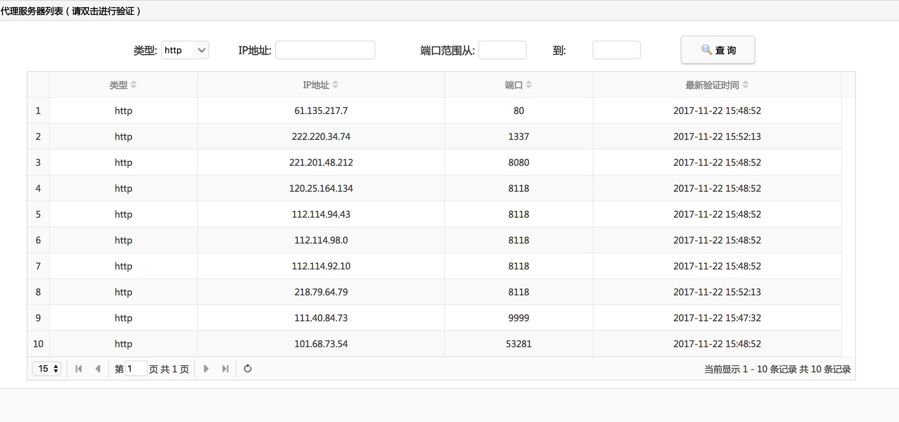

# ProxyPool

[](http://www.weibo.com/fengzhizi715)
 [  ](https://bintray.com/fengzhizi715/maven/proxypool/_latestVersion)
[](https://www.apache.org/licenses/LICENSE-2.0.html)


获取可用代理池的库，从网上抓取的代理很多都是不可用的。这个库先用爬虫抓取代理，再做一些检查是否可用，可用的话就存放到mongodb中。

ProxyPool可以供给网络爬虫使用，ProxyPool由Spring Boot+RxJava2.x+MongoDB搭建


# 使用方法：
## 单独使用ProxyPool抓取逻辑，无任何界面，可用于任何项目，无侵入性

对于Java工程如果使用gradle构建，由于默认没有使用jcenter()，需要在相应module的build.gradle中配置

```groovy
repositories {
    mavenCentral()
    jcenter()
}
```

Gradle:

```groovy
compile 'com.cv4j.proxy:proxypool:1.1.5'
```


## 也可以将该repository clone下来独立运行，带web界面

本地需要事先搭建好MongoDB的环境。

可用的代理会存放到MongoDB中，每隔几小时(可配置)会重新抓取一次可用的代理。如果在抓取代理时遇到http status 503的情况，代理池会使用其中的代理来访问数据源再进行抓取。

最新的免费代理资源：http://47.97.7.119:8080/proxypool/proxylist

管理代理资源网站：http://47.97.7.119:8080/proxypool/resourcelist

把代理资源添加到计划任务：http://47.97.7.119:8080/proxypool/planlist

预览效果如下：




另外，还提供了一个接口，可以返回代理池中的Proxy

线上环境地址：http://47.97.7.119:8080/proxypool/proxys/{count}

类型：GET

参数说明：count<=0  或 count>数据库里总数量， 也返回全部的代理数据

> 以上链接在本地运行时，请把具体的IP地址替换成localhost即可


# 联系方式:
QQ交流群：490882934

